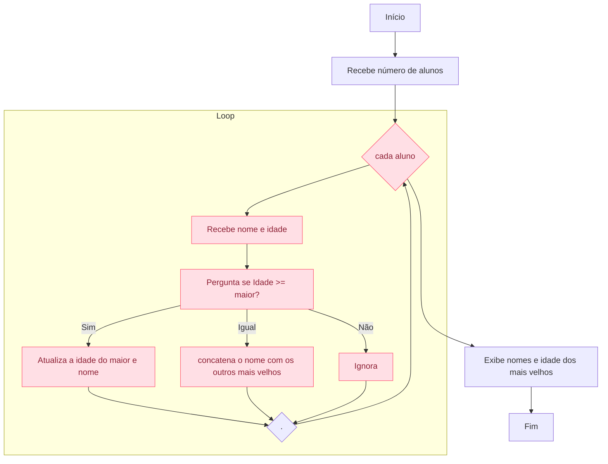

# 🧑‍🎓 Projeto: Identificação do Aluno Mais Velho – Portugol

## 🎯 O que é / Objetivo do Projeto

Este projeto está sendo desenvolvido no início da minha jornada na faculdade de ADS com o objetivo de praticar **estruturas de repetição**, **condicionais** e **leitura de dados** na linguagem Portugol. A aplicação solicita o nome e idade de vários alunos e, ao final, exibe quem é o mais velho (ou os mais velhos, em caso de empate).

### 📝 Diagrama de Fluxo (Mermaid)

---

## 🛠️ Tecnologias Utilizadas

- ✅ **Portugol Studio**  
  Ambiente de desenvolvimento educacional para lógica de programação com sintaxe em português estruturado.

---

## 🚀 Como Rodar a Aplicação

1. Instale o **Portugol Studio**:  
   👉 [https://portugol-webstudio.cubos.io/](https://portugol-webstudio.cubos.io/)

2. Abra o Portugol Studio e cole o conteúdo do arquivo `maior_idade.por` no editor.

3. Clique em **Executar** ▶️ e siga as instruções do terminal:
   - Digite o número de alunos
   - Para cada aluno, informe o nome e a idade

4. Ao final, o programa mostrará quem é o aluno mais velho ou quais alunos estão empatados com a maior idade.

---

## 📚 Observação

> Este é um projeto simples, feito como o primeiro desafio da materia de lógica de programação 
---

## 📂 Arquivo principal

- `maior_idade.por` → Contém o código do algoritmo em Portugol.

---

## 📃 Licença

Este projeto está aberto para fins educacionais.
